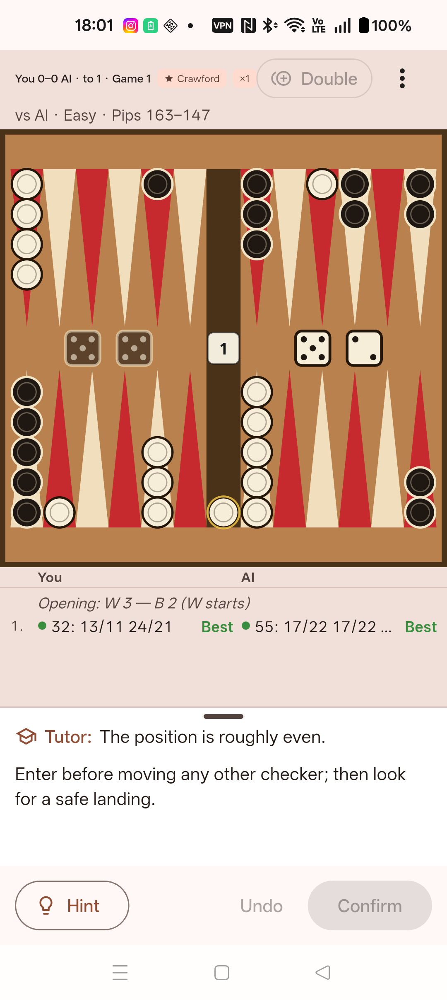
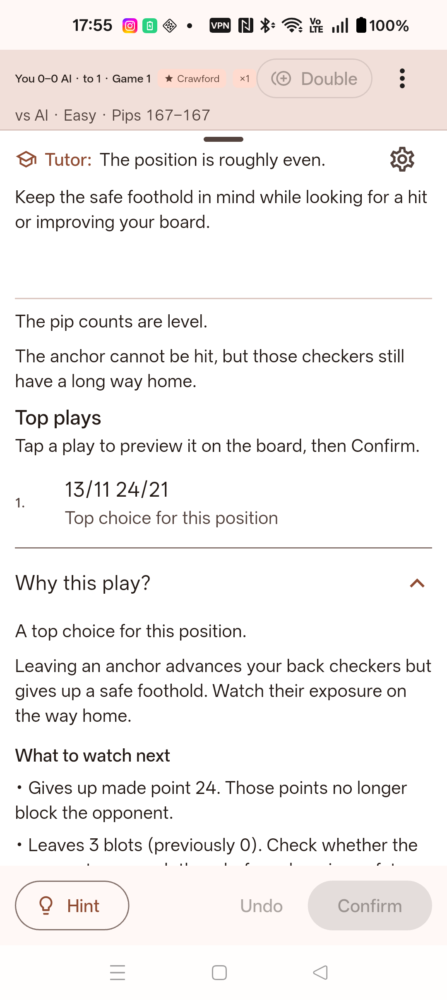
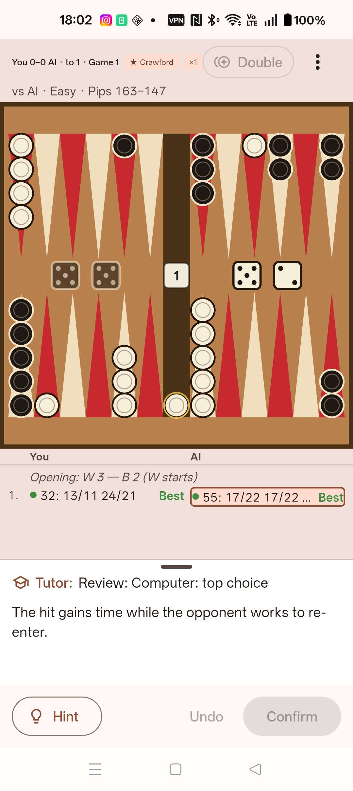

# Backgammon Buddy

**Play. Understand. Improve.**

Backgammon Buddy is a backgammon tutor by [Freevia](https://freevia.org/). Play
against the computer, see stronger moves with explanations grounded in the
position, and revisit decisions worth learning from.

[Website](https://freevia.org/backgammon-buddy/) ·
[Support](https://freevia.org/backgammon-buddy/support/) ·
[Privacy](https://freevia.org/backgammon-buddy/privacy/)

## See the app

  
  
  

These are real Android screenshots from an earlier 0.14.0 internal test build;
the current build may differ. [See the screenshots on the website](https://freevia.org/backgammon-buddy/#screenshots).

## Get the app

- **Google Play — Android internal test:** [Join with an invited Google account](https://play.google.com/apps/internaltest/4701280291485247000). Version 0.14.0 (build 10024) is available to invited testers only. The public release is under Google review; a general download is not available yet.
- **App Store — iOS next:** Not available yet. There is no App Store listing or release date.

## What you can do

- Play against the computer with on-device hints, move explanations and game commentary. Adjust how much help the tutor gives you.
- Review saved games, practise missed decisions and keep your progress on your device.
- Play hot-seat, nearby or online matches with other people. Live peer matches are unassisted; review comes afterward.

## Help shape Backgammon Buddy

[Get support](https://freevia.org/backgammon-buddy/support/) ·
[Share feedback or an idea](https://github.com/freevia-org/backgammon-buddy/issues/new?template=feature_request.yml) ·
[Report a bug](https://github.com/freevia-org/backgammon-buddy/issues/new?template=bug_report.yml)

GitHub issues are public. Remove private match codes, personal information and
unredacted diagnostics before posting. For a private matter, use
[Freevia support](https://freevia.org/backgammon-buddy/support/).

## Legal and data

[Privacy policy](https://freevia.org/backgammon-buddy/privacy/) ·
[Online-data deletion](https://freevia.org/backgammon-buddy/privacy/#retention) ·
[MIT license for Freevia's original code](LICENSE) ·
[Third-party notices](native/licenses/README.md)

Third-party code, models and data retain their own licenses and notices.

## For contributors

The app is built with Flutter and uses the vendored
[wildbg](https://github.com/carsten-wenderdel/wildbg) neural-net engine.
The [technical reference](docs/technical-reference.md) preserves the detailed
repository layout, development setup, architecture and CI notes from the
previous README. See the [release-readiness checklist](docs/release-readiness.md)
for candidate checks; it is not a public-install page.
